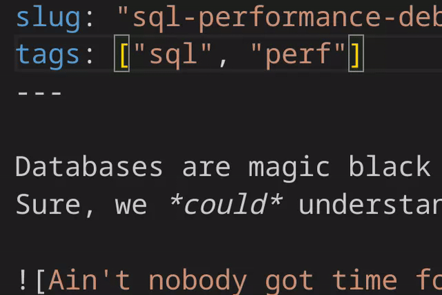

# Hugo Tags Helper  
Simple extension to stop me accidentally duplicating tags.  
When on the `tags:` line of frontmatter, this extension will suggest previously used tags.  

This extension regenerates tags every 7 days or can be manually regenerated with command `Regenerate Hugo Tags`.  

## Notes  
- Currently only supporting `---` frontmatter definitions  
- Expects single line `tags:`  
- Expects files with frontmatter to be called `index.md`  

// handle +++
// handle multi-line tags array
// Can we do anything tricky with the language server?